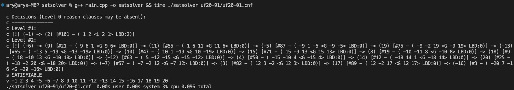
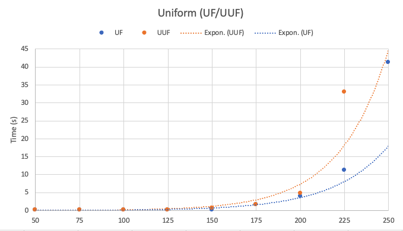
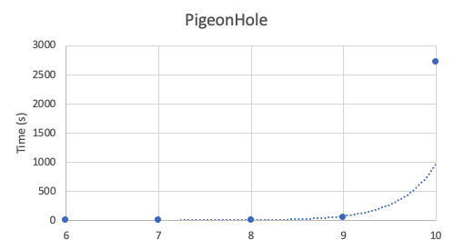

# babySAT

Baby Steps to a SAT Solver. This solver is designed to put in practice several interesting concepts I read about regarding practical [SAT solving](https://en.wikipedia.org/wiki/Boolean_satisfiability_problem) as a **small** program, without losing too much performance. Corresponding (excellent!) resources are left as comments in source for relevant sections.

## Compilation and Execution

Use your favourite C++ compiler to compile. Sample command:

```sh
g++ main.cpp -o satsolver
```

To execute the resulting program, pass a CNF File (DIMACS format) as the first argument, e.g.:

```sh
./satsolver mycnf.cnf
```

A sample execution of the babySAT is as follows:
* Decisions made at each decision level are broken down
* Reason clauses causing unit propagation are attached to relevant decisions.
* Other information are available (e.g. reason clause's LBD, clause is Given[G] or Learned[L], etc.)



CNF files used during development are [benchmark problems from SATLIB](https://www.cs.ubc.ca/~hoos/SATLIB/benchm.html).

## Sample Performance

The performance of the SAT solver against several benchmarks are shown below (execution on 2.3Ghz Intel Core i9 with 32GB RAM):

* **UF/UUF** - Uniform Random 3-SAT Problem (A sample of 10 is taken, executed 3 times each). X-axis represents number of variables (# clauses approximately 4.3x # variables)



* **Pigeonhole** - Placing n + 1 pigeon into n holes without 2 pigeons in the same hole (UNSAT). X-axis represents n.


